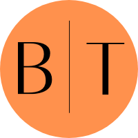

## BloomTronics

<h1 align="center">
 

 
</h1>

> Bloom Tronics is an electronics ecommerce website dedicated to wide range of products of various sizes and features.
---

<!-- TABLE OF CONTENTS -->

  
Table of Contents

  <ol>
    <li>
      <a href="#about-the-project">About The Project</a>
    </li>
    <li>
      <a href="#features">Features</a>
    </li>
      <li><a href="#Built-With">Built With</a></li>
    <li><a href="#How-to-Run-Project-Locally">How To Run Project Locally</a></li>
    <li><a href="#Author-info">Author info</a></li>
  </ol>

##  **About The Project**

<!-- Features -->
## **Features**

- Filters on Product Listing Page
  - Category
  - Include Out Of Stock
  - Price Range
  - Sort Products By Price and Rating 

- Wishlist Management
  - Add/Remove item to Wishlist
  - Move item to Cart from Wishlist

 - Cart Management
    - Add/Remove item to Cart.
    - Increase/Decrease quantity of item in Cart.
    - Move item to Wishlist from Cart.
    - Order summary

  ## **How to Run Project Locally**

1. Fork The Project
2. Open Project in Your IDE
3. Open Terminal and type **npm install** then press enter
4. After the Node Modules are installed now run the project with command **npm start**.

## **⚙ Built With**

- [ReactJS](https://reactjs.org/)
- [React Router](https://reactrouter.com/)
- [Bloom-UI](https://bloom-component-library.vercel.app/)
- [Mockbee](https://www.mockbe.netlify.app/)
- [Font Awesome](https://fontawesome.com/)

## 🔗 Author-info

